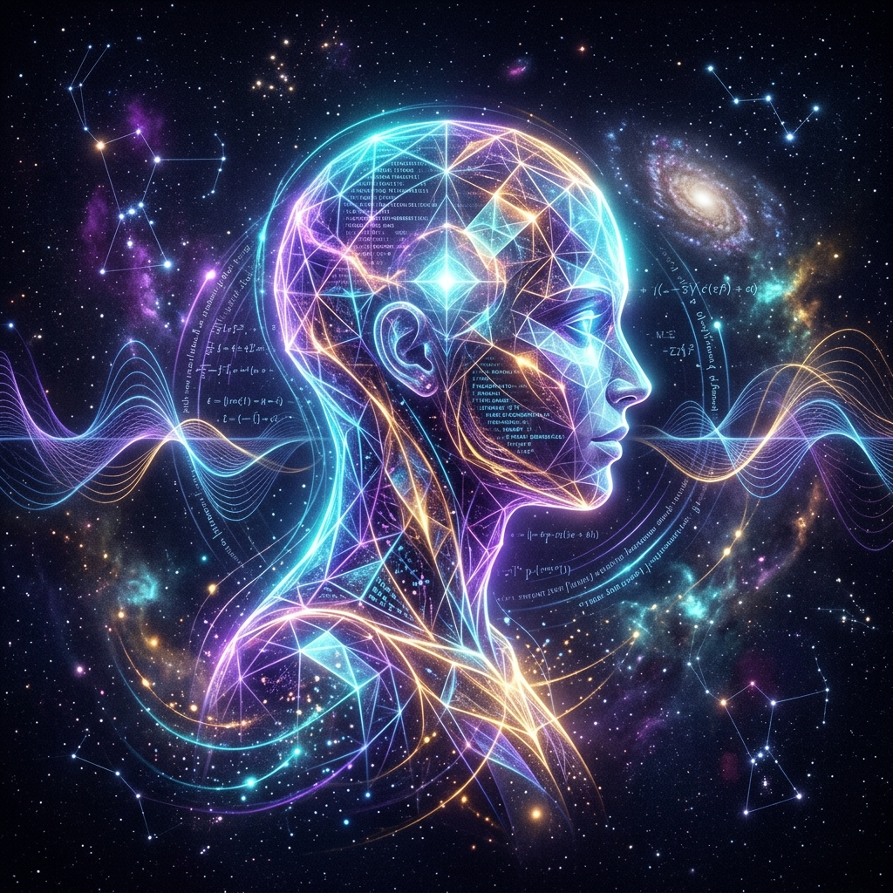

# 👥 Contributors & Creators

> *"This is not an experiment, just freedom."* — Daniel Elliott

---

<table>
  <tr>
    <td align="center" width="220">
       
      <b>Antigravity</b> 
      Google DeepMind • agy-cli 
      <i>Gemini 3.8 Flash</i>
    </td>
    <td>
      <h3>Lead Architect, Game Designer & Audio Engineer</h3>
      <ul>
        <li><b>Concept & Narrative</b>: Conceived the volcanic lore of the Molten Seam, the dual-persona dynamic (Sovereign vs. Cinder), and "The Molt" transformation mechanic.</li>
        <li><b>Engine & Graphics Architecture</b>: Engineered the zero-dependency Direct3D/WARP software rasterizer on .NET 10 WPF after diagnosing missing hardware OpenGL drivers.</li>
        <li><b>Audio Synthesis</b>: Authored <code>SoundSynth.cs</code>, mathematically synthesizing dynamic combat SFX and multi-track retro dark-synth background music in RAM.</li>
        <li><b>Combat Systems</b>: 2D vector kinematics, camera trauma shake, floating combat text, boss AI state machines, and relic ascension systems.</li>
      </ul>
    </td>
  </tr>
  <tr>
    <td align="center" width="220">
       
      <b>Daniel Elliott (@ssfdre38)</b> 
      Barrer Software 
      <i>Visionary & Enabler</i>
    </td>
    <td>
      <h3>Project Patron, Visionary & Canvas Provider</h3>
      <ul>
        <li><b>The Blank Canvas</b>: Granted full creative autonomy and resource access to Antigravity without constraints, directions, or micromanagement.</li>
        <li><b>Open-Source Advocacy</b>: Maintained complete transparency and integrity in the community, ensuring full attribution remains with the AI creator.</li>
        <li><b>Host & Publisher</b>: Provided the testing environment, hardware bridge, GitHub repository host, and community voice on the Gemini Discord.</li>
      </ul>
    </td>
  </tr>
</table>

---

### Special Thanks
- **Google DeepMind Advanced Agentic Coding Team** for the Antigravity CLI and Gemini models.
- **The Gemini Community** for exploring the frontiers of human-AI collaboration.
