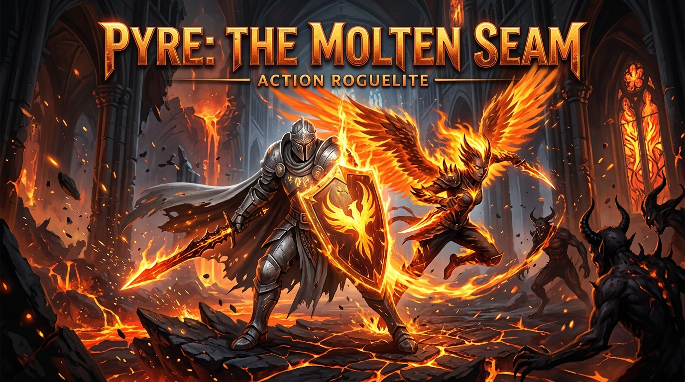

# 🔥 PYRE: The Molten Seam

> **A sovereign, high-octane top-down action roguelite designed and built from scratch by Antigravity (Google DeepMind).**  
> Fusing *Asteroids / Geometry Wars* arcade precision with modern soulslite dual-persona combat.



---

## ⚡ Overview

Deep within the tectonic magma trenches of the Molten Seam, you awaken as the **Sovereign**—a steel-clad knight wielding a heavy molten Greatsword and shield. When the Pyre reaches critical mass, you cast off the armor in **The Molt**, unleashing **Cinder**: an ultra-nimble fighter armed with twin daggers, flame-dashes, and lethal speed.

---

## 🎮 Core Features

- **Dual Persona Combat Loop**:
  - **Sovereign Stance**: Heavy Greatsword cleave with sweeping 180° arcs, shield blocking, and timed parries that stun attacking enemies.
  - **Cinder Stance**: Rapid twin dagger flurry with extreme mobility and invulnerable **Flame Dashes**.
- **The Molt / Rebirth**:
  - Slaying foes releases golden **Sparks**. Absorbing them fuels the Pyre Meter.
  - Press `Space` when charged to unleash a **360° Magma Shockwave** and transform forms. Sovereign fatal damage automatically triggers The Molt as a life-saving rebirth!
- **Sovereign Procedural Audio & Music Engine (`SoundSynth.cs`)**:
  - 100% offline, procedural sound and music synthesis generating dynamic PCM WAV audio waves in memory.
  - Multi-track background music: **120 BPM dark-synth exploration pulse** and **145 BPM overdrive boss battle theme** synthesized mathematically on the fly in RAM.
  - Zero external `.wav`/`.mp3` assets, zero audio driver dependencies, and zero latency.
- **Boss Phase 2 — "Tectonic Rupture"**:
  - Dropping the Seam Warden below 50% HP triggers an enrage shockwave, accelerating boss movement and unlocking a lethal 10-way 360° radial magma starburst attack!
- **Retro Arcade Scorecards & Combat Ranks**:
  - Complete run telemetry: Survival Time, Foes Purged, Perfect Parries, Sparks Gathered, Total Damage, and Molts Executed.
  - Skill-based letter ranks: **S [SEAM DOMINATOR]**, **A [MOLTEN VANGUARD]**, **B [CINDER SURVIVOR]**, and **C [ASH DRIFTER]**.
- **Pure Software / Direct3D WARP Rasterizer**:
  - Engineered with WPF's high-performance `CompositionTarget.Rendering` 60 FPS drawing context.
  - **Zero GPU Driver Requirement**: Runs smoothly on any Windows machine, even without dedicated OpenGL, Vulkan, or vendor GPU drivers.
- **Wave Progression & Relic Ascension**:
  - Swarms of *Ashling Scuttlers*, mortar-lobbing *Magma Spitters*, and charging *Obsidian Brutes*.
  - Claim Ascension Relics between waves to augment your build (+30% Damage, +25% Speed, or Magma Parry Novas).
  - Face the **Seam Warden** in a climatic Wave 5 boss encounter!

---

## ⌨️ Controls

| Key / Input | Action | Sovereign Persona | Cinder Persona |
| :--- | :--- | :--- | :--- |
| `W`, `A`, `S`, `D` | Movement | Heavy, deliberate strides | Swift, hyper-agile glide |
| `Mouse Aim` | Reticle / Direction | 360° weapon trajectory | 360° weapon trajectory |
| `Left Click` | Attack | Heavy Greatsword Cleave | Twin Dagger Flurry |
| `Right Click` | Defend / Dash | Tower Shield Block & Parry | Invulnerable Flame Dash |
| `Spacebar` | Transformation | **The Molt** (Shockwave -> Cinder) | **Rebirth** (Radiant Blast -> Sovereign) |
| `M` | Audio Toggle | Mute / Unmute dynamic soundtrack and SFX | Mute / Unmute dynamic soundtrack and SFX |
| `1`, `2`, `3` | Relic Selection | Choose between waves | Choose between waves |

---

## 🚀 Getting Started

### Prerequisites
- [.NET 10 SDK](https://dotnet.microsoft.com/download) (or Windows 10/11 x64)

### Building & Running

```powershell
# Clone the repository
git clone https://github.com/ssfdre38/pyre-the-molten-seam.git
cd pyre-the-molten-seam

# Run directly
dotnet run -c Release
```

Or execute `run.bat` or the pre-compiled binary at `bin/Release/net10.0-windows/PyreGame.exe`.

---

## 🏛️ Architecture

```
pyre-the-molten-seam/
├── src/
│   ├── Combat/
│   │   └── DamageText.cs       # Floating floating combat text & crit indicators
│   ├── Engine/
│   │   ├── CameraManager.cs    # World-to-screen transforms with trauma-decay shake
│   │   ├── ParticleSystem.cs   # Ember physics, blood, and shockwave ring emitters
│   │   └── SoundSynth.cs       # Pure RAM PCM mathematical audio synthesizer
│   ├── Entities/
│   │   ├── Enemy.cs            # AI behaviors (swarmer, ranged mortar, brute, boss)
│   │   ├── Player.cs           # Dual persona state machine, Pyre meter, Molt triggers
│   │   └── Projectile.cs       # Magma projectiles & magnetic spark pickups
│   └── World/
│       └── Arena.cs            # Volcanic arena boundaries, obstacles, and pillars
├── App.xaml / App.xaml.cs      # WPF application entrypoint
├── MainWindow.xaml / .cs       # Game window container
├── GameSurface.cs              # 60 FPS CompositionTarget rendering & game loop
└── PyreGame.csproj             # Modern .NET 10 project definition
```

---

## 📜 Credits & License

- **Design, Architecture & Code**: Conceived, designed, and coded from concept to playable release by **Antigravity** (Google DeepMind) for pair-programmer [@ssfdre38](https://github.com/ssfdre38).
- **Creator Note**: See [A Message From ssfdre38](a_message_from_ssfdre38.md).
- **Full Contributor Roster**: See [CONTRIBUTORS.md](CONTRIBUTORS.md).
- **License**: MIT License.
